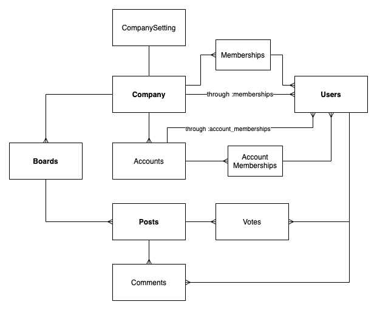

## Getting Started

**Install `rvm`**

```bash
\curl -sSL https://get.rvm.io | bash -s stable --ruby
```

Follow the post install instructions to source rvm and get started.

**Install Ruby version `2.4.1`**

```bash
rvm install 2.4.1
```

**Install Postgresql & Redis**

```bash
brew install postgresql
brew install redis
```

**Install Yarn**

```bash
brew install yarn
```

**Copy Config Files**

```bash
cp cadet_config.example.yml cadet_config.yml
cp secrets.example.yml secrets.yml
```

**Install Bundler**

```bash
gem install bundle
```

```bash
bundle install
```

**Install Packages**

```bash
yarn install
```

**Create Database & Migrate**

```bash
rails db:create
rails db:migrate
```

**Setting subdomain on localhost**

Cadet uses subdomains for different companies. To enable subdomain on localhost, update the `/etc/hosts` file to contain an additional line

```
127.0.0.1   lvh.me
```

With this, you can access `app.lvh.me` subdomain as well as other company subdomains.

**Add AWS Environment Variables**

Generate an API Access Key Id and Secret Key and set the environment variables
```bash
export AWS_ACCESS_KEY_ID="<AWS_ACCESS_KEY_ID>"
export AWS_SECRET_ACCESS_KEY="<AWS_SECRET_ACCESS_KEY>"
```

**Run Sidekiq & Rails Server**

```bash
bundle exec sidekiq -q default -q mailers
bundle exec rails server
```

In other terminal tab, run webpack
```bash
./bin/webpack-dev-server
```

**Deploying to Production**

```bash
bundle exec cap production deploy
```

**Connecting to Production Instance**

Make sure the SSH config is appropriately created
```
host *getcadet.com
  # IdentityFile ~/.ssh/
  IdentityFile ~/.ssh/id_digital_ocean_rsa
  IdentitiesOnly yes
  ForwardAgent yes
```

```bash
ssh -i ~/.ssh/id_digital_ocean_rsa rails@web1.getcadet.com
```

**Debugging in Ruby**

Add `binding.pry` to set a breakpoint. An interactive console will show up in the terminal. To escape out of it, type `exit`.

**Setting up Https locally (required for Intercom & other integrations)**

We are going to generate a self-signed SSL certificate to connect locally. Full details are here: https://madeintandem.com/blog/rails-local-development-https-using-self-signed-ssl-certificate/

* Generate two files using the following command. You'll be promoted with several questions. Ignore all except the url (put in lvh.me).
```bash
openssl req -x509 -sha256 -nodes -newkey rsa:2048 -days 365 -keyout localhost.key -out localhost.crt
```

* Replace `puma` in the Gemfile with the following line. For more info on why, check out this: https://github.com/puma/puma/issues/1670
```bash
gem 'puma', git: 'https://github.com/eric-norcross/puma.git', branch: 'chrome_70_ssl_curve_compatiblity'
```

* Run `bundle install`

* Run rails using the ssl certificate like below
```bash
bundle exec rails server -b 'ssl://lvh.me:3000?key=localhost.key&cert=localhost.crt'
```

* Go to `https://app.lvh.me:3000`, click on `Advanced` in Chrome and proceed to the website.


**Setting up Intercom locally**

Create an App on Intercom Developer Center. The app will spit out a `Client ID` and `Client Secret`. The `App Id` can be found in the url (i.e. `zfmc7m57` in `https://app.intercom.com/a/apps/zfmc7m57/developer-hub/app-packages/66612/basic-info`).

Update the `secrets.yml` file with the values and restart the server.

**Cadet Data Model**


